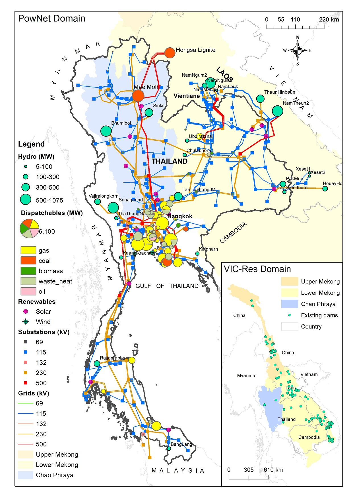
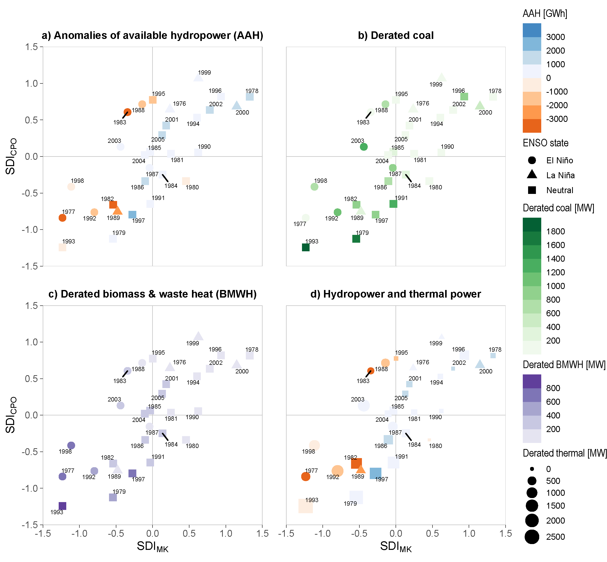
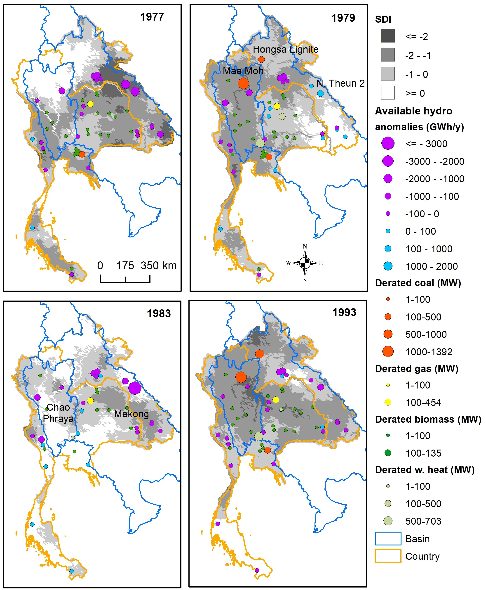

```{r setup, include=FALSE}
knitr::opts_chunk$set(echo = FALSE)
```

A massive power grid, capacity 47.89 GW, connects Laos and Thailand, spanning the Mekong, Chao Phraya, and smaller river basins. This power grid is the subject of our recent work [@chowdhury2021], just published in Earth's Future.



<p style="text-align: center; font-style: italic;">The Laos-Thailand power grid, encoded in the power system model PowNet [@chowdhury2020]. Inset: the Mekong and Chao Phraya River Basins, modeled with VIC-Res [@dang2020].</p>

6.1 GW of capacity comes from hydropower, with 23 dams punctuating the river basins. Another 8.2 GW comes from thermal power plants that require river flow for cooling---during droughts, these plants have to be derated. In total, about 30% of installed capacity is dependent on freshwater supply from the rivers. These rivers are strongly influenced by climate. In particular, they tend to have low flow in El Ni&ntilde;os and high flow in La Ni&ntilde;as. How do these variations affect the power system? Is it robust enough against climate?

To answer these questions, we modeled the system. We fixed its configuration as of 2016, and simulated it with 30 years of climate data, from 1976 to 2005. In other words, we simulate, hypothetically, how the current system would behave if it were to experience the climate of those recent 30 years.

First, we modeled river discharge from climate inputs with the VIC-Res model [@dang2020]. VIC-Res explicitly accounts for reservoirs, a critical component that is absent in most hydrological models. Having river discharges, we then determined the available capacity from the water-dependent plants. Next, we used a unit commitment model, PowNet [@chowdhury2020], to simulate hourly electricity dispatches to consumers. Thus, we were able to model the whole behavioral chain from the climatic inputs to the power outputs.

We found that indeed the system is strongly influenced by climate: during dry years (which often coincide with El Ni&ntilde;os), there is less hydropower available, thermal power plants are derated, and consequently, productions are reduced. 



<p style="text-align: center; font-style: italic;">System behaviors in different climatic and hydrologic conditions. SDI: standardized streamflow index (z-score of the Box-Cox transformed flow). negative SDI indicates dry conditions (the lower the drier), and positive SDI indicates wet conditions (the higher the wetter). MK: Mekong. CPO: Chao Phraya and others.</p>

While these general behaviors are intuitive, only by modeling the system at high levels of details can we quantify the amount of climate impact. Less hydropower means more coal and gas, i.e., higher costs and more CO<sub>2</sub> emission. We calculated that during droughts, power production costs increase by up to 120 million USD, and CO<sub>2</sub> emission increases by up to 2.5 million tonnes compared to normal conditions. While the system can switch from one energy source to another, it has little buffer against climate in terms of cost and carbon footprint.

Our simulations also reveal the spatial behavior of the system. Not all droughts are equal. When there are compound droughts in both the Mekong and the Chao Phraya, the system is more severely impacted. Why? Because the river basins are interlinked through the grid. And what's interesting is that the grid flow in almost one direction: Thailand imports 90% of Laos' electricity production from the Mekong, in addition to its own production from the Chao Phraya and other basins. This means that Thailand is particularly vulnerable to compound droughts. And we know that compound droughts had happened multiple times in the past eight centuries [@nguyen2020].



<p style="text-align: center; font-style: italic;">Examples of system behavior in severe drought years.</p>

We hope that our study has shed some more lights on the role and characteristics of reservoirs and power system (plants and grid) in the region, so that we can better manage them.


